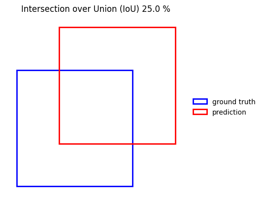
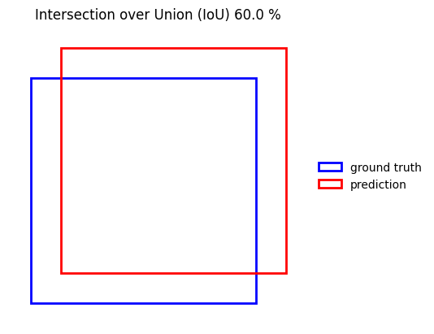
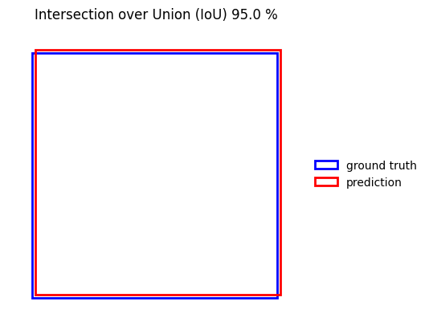

# IoU Visualization

This function visualizes the **Intersection over Union (IoU)** between two identical squares.

## Description

Given a target IoU value (between 0 and 1), the function plots the resulting geometric configuration and shows the overlap between both squares.

## Input

- `IoU` (float): Desired Intersection over Union value (0 to 1)

## Output

The code outputs a matplotlib figure showing both the ground truth and prediction squares, their spatial shift, and their overlap representation.

---

## Examples

### IoU = 0.25

```python
IoU_plot(0.25)
```


### IoU = 0.25

```python
IoU_plot(0.25)
```


### IoU = 0.25

```python
IoU_plot(0.25)
```

